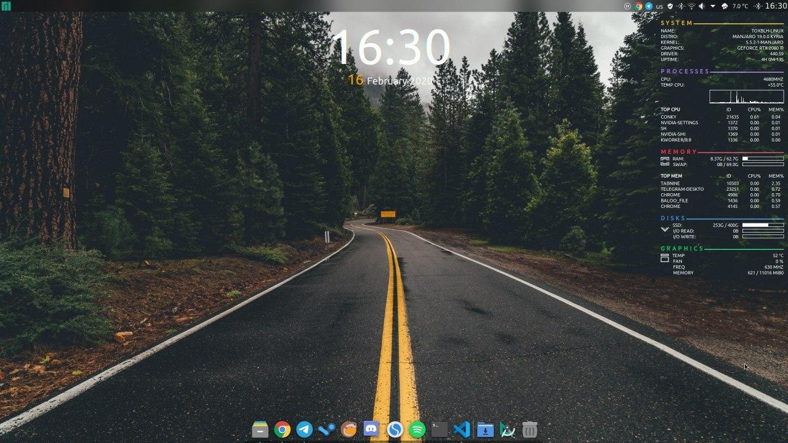

# 🐧 Linux Applications
My pack of applications and dotfiles which I use on Linux / MacOS

Small history part. From 2014 I use macOS as home and work station, in parallel was Windows station for games and surfing the internet. After building a new PC I install Windows for games and install Linux distro as the second system for work. So at home Linux stay my main OS, and at work I still use macOS. And now I in progress to create the best pack of apps for work and life on Linux. The pack will be to update as I will found the best solutions.

> TS - test stage, recently found, try to use. But not sure that is best

>  - Snapcraft links

>  - Flatpak links

### Distro now: ~~[ Ubuntu 19.04](https://ubuntu.com/)~~ [ Arch Linux](https://www.archlinux.org/)

## Browser
- [ Google Chrome](https://www.google.com/chrome/)
- [ Firefox](https://www.mozilla.org/en-GB/firefox/) Moved from my Chrome for Linux.

## Mail:
- [ Geary](https://gitlab.gnome.org/GNOME/geary/) Switched from thunderbird, that more like macOS mail client.
- [ Thunderbird](https://www.thunderbird.net) + https://www.omgubuntu.co.uk/2018/08/monterail-thunderbird-theme-add-ons - I use it long time, but that mail client looks like step back after Gmail Web Client and macOS Mail.app. I'll follow the project. It's good, but don't match perfect to me.

## Music
- [ Spotify](https://www.spotify.com) - Streaming service for music for all your devices
- [ Lollypop](https://gitlab.gnome.org/World/lollypop)  Really nice music player.

## Messengers
- [ Telegram](https://desktop.telegram.org/)   - The messaging app with a focus on speed and security, it’s super fast, simple and free.
- [ Discord](https://discordapp.com) - Discord is a free voice and text chat client for gamers and non-gamers alike. You can use it from your browser and it's available on iOS, Android, Windows, Mac, and Linux.
- [ Slack](https://slack.com)

## Games
- [ Steam](https://store.steampowered.com/)
- [ Lutris](https://lutris.net/) That WINE, but almost without pain for a lot of games

## Utils
- [ GWE](https://gitlab.com/leinardi/gwe) Like GPU-Z + MSI Afterburner for NVIDIA
- [ CPU-X](https://x0rg.github.io/CPU-X/) Like CPU-Z in Windows
- [ qBittorrent](https://qbittorrent.org/)
- [ pSensor](https://gitlab.com/jeanfi/psensor)
- [ Timeshift](https://github.com/teejee2008/timeshift) - Awesome backup system, already twice restored my system after experiments. Highly recommend.
- [ TeamViewer](https://www.teamviewer.com) - Remote control and remote support

## Code editor
- [ Visual Studio Code](https://code.visualstudio.com/) - Lightweight Source Code Editor and text as well

## Notes
- [ Simplenotes](https://simplenote.com/) - Best that is match with me. It has as simple notes and markdown notes. Client has on all popular OS include mobiles. Also, has synchronization.
- [ Boostnotes](https://boostnote.io/) - Cool notes with markdown, but without synchronization in the box. And without mobile client
- [ Tusk](https://github.com/klaussinani/tusk) - Good Notes if you use Evernote

## Video/Graphics/3D editors
- [ DaVinci Resolve](https://www.blackmagicdesign.com/products/davinciresolve/) - Video editor, I think the best for Linux
- [ Krita](https://krita.org/) (TS) - Krita is a professional free and open source painting program.
- [ Inkscape](https://inkscape.org/) (TS) - Free and open-source vector graphics editor
- [ Open Broadcaster Software](https://obsproject.com/) - For video recording and live streaming.
- [ Blender](https://www.blender.org/) - Fully-featured extensible cross-platform 3D content suite.

## Docs
- [ Google Docs](https://www.google.com/docs) Web docs, I use every day.
- [ WPS](https://www.wps.com/office/linux) - Analogue LibreOffice looks like MS office
- [ LibreOffice](https://www.libreoffice.org/) - So after long time it's my general office for Linux

## Photo/Video/Files viewers
- [ VLC](http://www.videolan.org/vlc/index.html) - Multimedia player and framework that plays DVDs, Audio CDs, VCDs, and various streaming protocols.

## Ebook
- [ Foliate](https://github.com/johnfactotum/foliate) - Best e-book reader for me
- [ Bookworm](https://github.com/babluboy/bookworm) - More liked Foliate. But also not bad

## Password Managers
- [ Bitwarden](https://bitwarden.com/) - Open-Source password manager, also you can self create your server for the manager
- [ 1Password](https://1password.com/) - IMHO the best password manager, but hasn't GUI client for Linux, but has CLI and as extension for browsers
